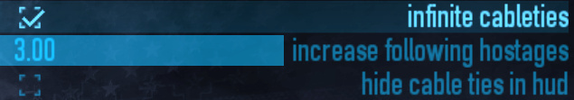
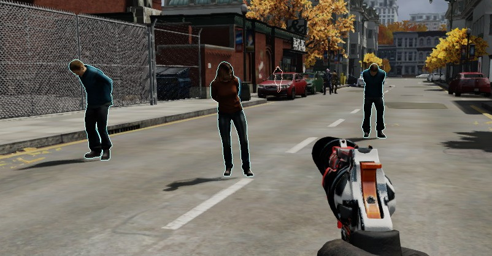

# Cableties and Hostages

this mod will give you access to infinite cable ties and allows you to have a greater number of following hostages. 

this mod works as **host only**

restart heist for settings to take effect.

----

  
<b>compatibility</b>

  i have no idea. if you encounter incompatibilities please provide evidence / examples

  
<b>recommended companion mods</b>

**[Hostage Pathing Fix by Schmuddel](https://modworkshop.net/mod/16753)**
to make hostages actually come to you, reducing hostage management frustration

**[Moveable Intimidated Cop by TdlQ](https://pd2mods.z77.fr/moveable_intimidated_cop.html)**
to better accommodate pacifist stealth runs

  
<b>f.a.q.</b>

**Q: will this mark me as a cheater?**

A: no, it will not.

**Q: can this work if I'm not hosting?**

A: this mod does not work if you aren't hosting.

**Q: why did you make this mod if alternatives exist**

A: this mod provides customizability and an all-in-one 'solution' to the unnecessary challenge of clean gameplay

  
<b>localisation credits</b>

**English**

* theokrueger (me)

**Chinese**
* [Arknights](https://modworkshop.net/user/44255)

please submit localisations!

## mirrors

[Github](https://github.com/theokrueger-mods/pd2-cableties-hostages)

[Gitlab](https://gitlab.com/theokrueger-mods/pd2-cableties-hostages)

[ModWorkshop](https://modworkshop.net/mod/31101)

## previews

## license

MIT, see [LICENSE](LICENSE)
